# AWS Automated Threat Detection & Response

> Event-driven cloud security project using GuardDuty, EventBridge, Lambda, and SNS to automatically detect and contain threats.

---

## Overview

This project demonstrates a **real-time automated incident response pipeline** in AWS.

When a critical threat is detected:

1. GuardDuty generates a finding  
2. EventBridge filters critical events  
3. Lambda isolates the EC2 instance  
4. SNS sends an alert notification  

---

## Architecture
GuardDuty → EventBridge → Lambda → EC2 Isolation
↓
SNS → Email Alert

---

## Technologies Used

- Amazon GuardDuty  
- Amazon EventBridge  
- AWS Lambda (Python)  
- Amazon SNS  
- Amazon EC2  
- AWS IAM  

---

## Implementation Steps (With Screenshots)

### 1. Enable EventBridge

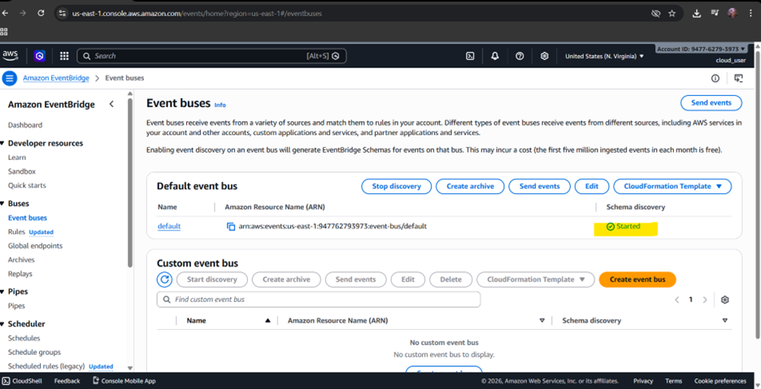

---

### 2. Enable GuardDuty

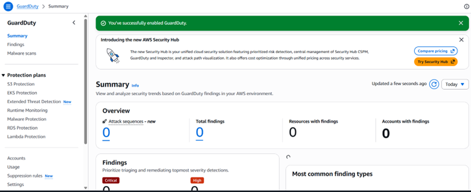

---

### 3. Launch EC2 Instance

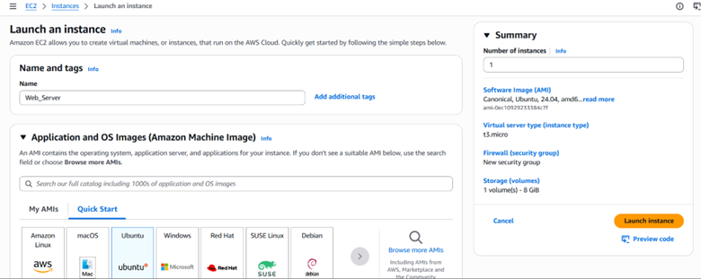

---

### 4. Verify EC2 Running

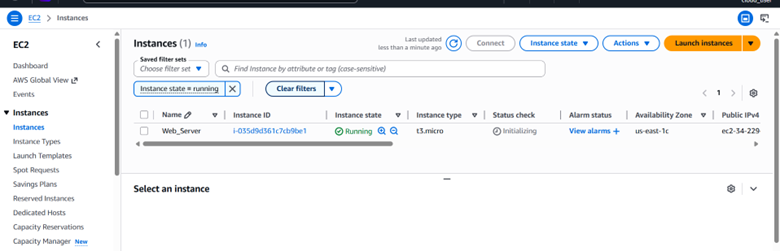

---

### 5. Create Containment Security Group

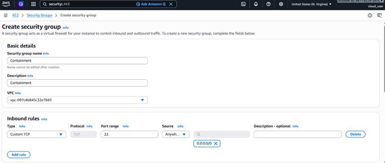

---

### 6. Create Lambda Execution Role

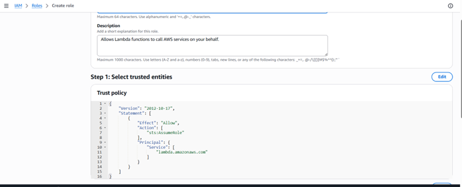

---

### 7. Create EventBridge Trust Policy

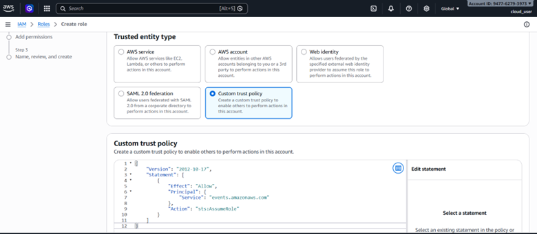

---

### 8. Create EventBridge Role

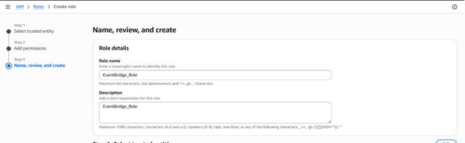

---

### 9. Attach Permissions

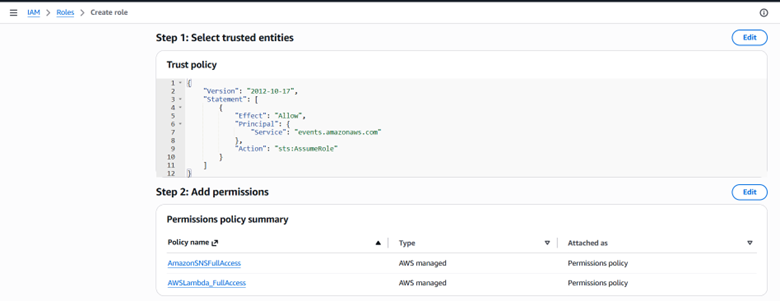

---

### 10. Create SNS Subscription

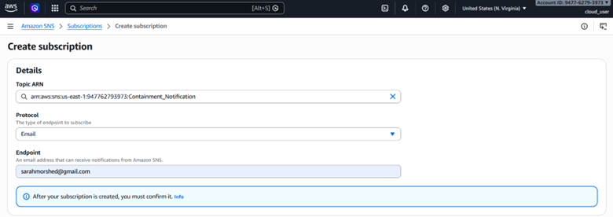

---

### 11. Confirm SNS Email

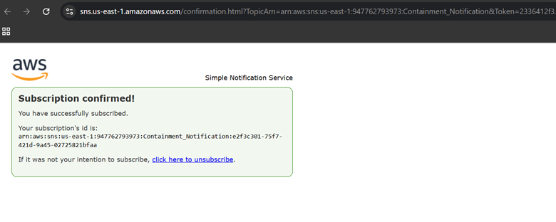

---

### 12. SNS Subscription Active

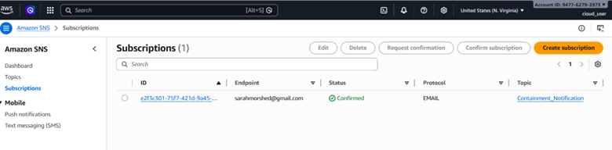

---

### 13. Create Lambda Function

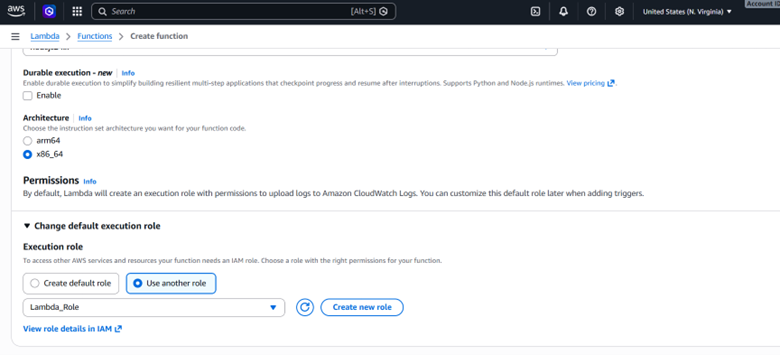

---

### 14. Add Lambda Code

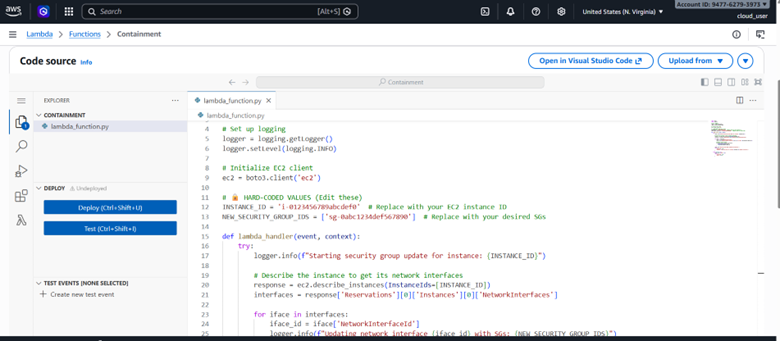

---

### 15. Configure Instance + Security Group IDs

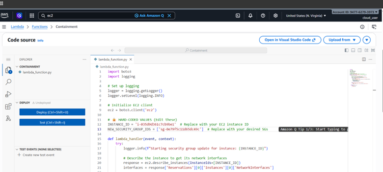

---

### 16. Create EventBridge Rule (JSON Pattern)

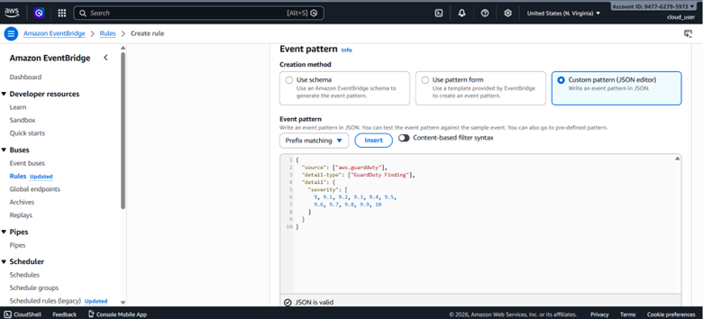

---

### 17. Add Lambda Target

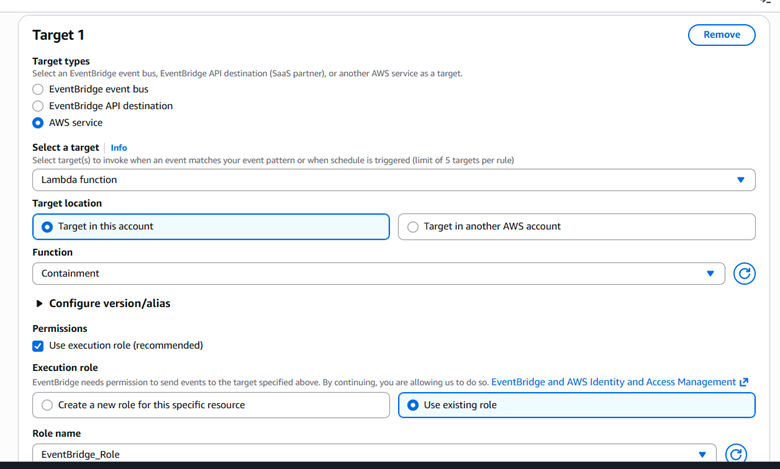

---

### 18. Add SNS Target

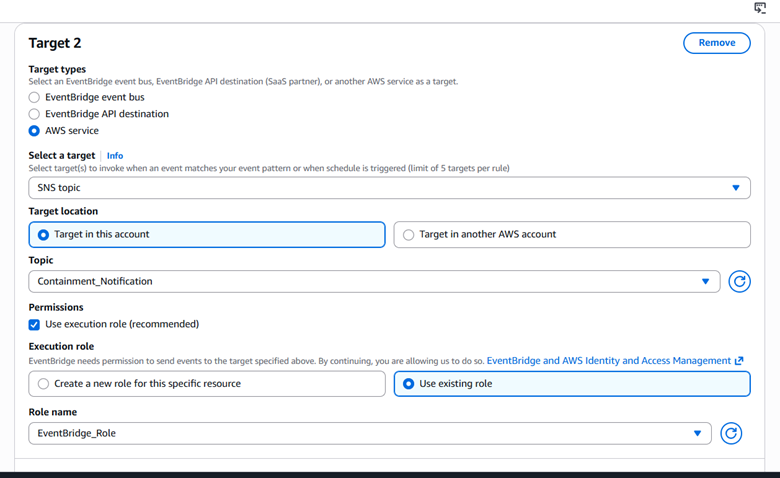

---

### 19. Generate GuardDuty Findings

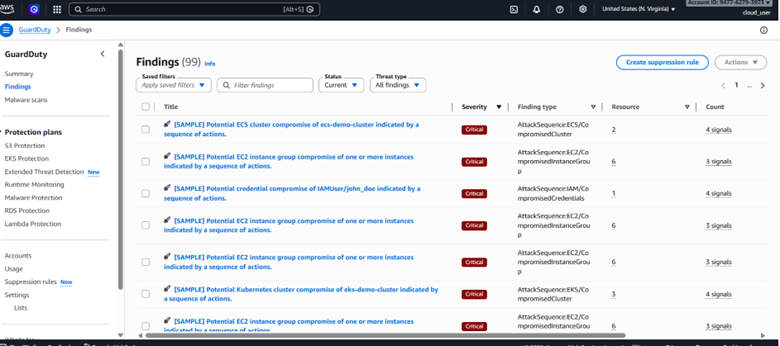

---

### 20. Verify Containment

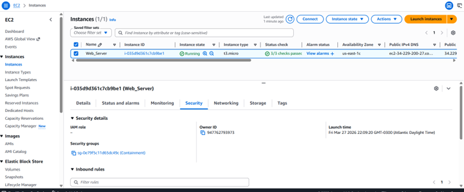

---

## Results

- EC2 instance automatically isolated  
- Security group replaced with containment group  
- Email alerts successfully triggered  
- Fully automated response pipeline  

---

## Key Insights

- Event-driven architecture enables real-time security automation  
- GuardDuty provides built-in threat intelligence  
- Lambda allows immediate remediation without manual action  
- SNS ensures visibility during incidents  

---

## Lessons Learned

- IAM permissions are critical for automation to work  
- EventBridge rules must match exact event patterns  
- There is slight delay in AWS event propagation  
- Security groups are effective for quick containment  

---

## Challenges

- Debugging IAM role permissions  
- Correctly configuring Lambda environment variables  
- EventBridge JSON filtering syntax  
- Delay in GuardDuty sample findings  

---

## Recommendations

### Security
- Apply **least privilege IAM policies**
- Restrict SSH to trusted IPs only  

### Monitoring
- Integrate **CloudWatch logs**
- Enable **AWS Security Hub**

### Automation
- Extend Lambda to:
  - Stop instances  
  - Snapshot volumes  
  - Tag compromised resources  

### Notifications
- Add Slack / Teams / PagerDuty integration  

---

## Conclusion

This project showcases how to build a **fully automated cloud security response system** using AWS-native services.

It highlights:
- Real-time detection  
- Automated containment  
- Scalable event-driven design  

---

## Project Structure
├── README.md
├── Lambda.py
├── Event_Pattern_Critical.json
├── EventBridge_Role_Trust.json
└── screenshots/

---

## Reference
- Pluralsight Lab  
- Lambda Code:  
https://github.com/pluralsight-cloud/LAB---AWS-Live-Threat-Detection-and-Response-Simulation/blob/main/Lambda.py
